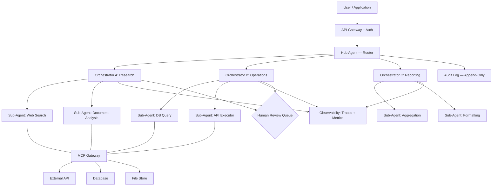

# Agent Hierarchy: Design Guidelines

> Part 2 of the agent architecture series. Covers the precise distinction between tools, sub-agents, and skills; hierarchy selection criteria; architecture capability guidelines; and the enterprise reference architecture.
>
> See [Agent Architecture Patterns](agent-architecture-patterns.md) for the pattern catalog with diagrams.

---

## When to use multi-agents systems

When to use: Multi-agent systems excel when single agents hit fundamental
limits. Choose multi-agent architectures when: (1) tasks involve open-ended
problems where it's difficult to predict the required steps in advance and require
the flexibility to pivot or explore tangential connections as the investigation
unfolds; (2) you need specialized expertise that would overwhelm a generalist
agent, research shows single agents fall off sharply when there are two or
more distractor domains; or (3) problems demand broad-based queries that
involve pursuing multiple independent directions simultaneously, where
parallel processing provides substantial performance gains. They're particularly
effective for complex research, comprehensive analysis spanning multiple
disciplines, or scenarios requiring sustained autonomous operation across
diverse knowledge domains.
Implementation considerations: Multi-agent systems deliver impressive
power for complex tasks, but that power comes with proportional complexity
in both architecture and operational costs. Multi-agent architectures consume
tokens rapidly, requiring tasks where the business value justifies the increased
performance costs. Design your system to scale effort appropriately—simple
queries shouldn't trigger expensive multi-agent workflows.

## Tools vs Sub-Agents vs Skills

These three primitives are frequently conflated. Each solves a different problem at a different layer of the architecture. Using the wrong one increases cost, creates governance gaps, or produces brittle systems.

| Dimension | **Tool** | **Sub-Agent** | **Skill** |
|---|---|---|---|
| **Definition** | A callable function invoked synchronously during an agent's turn | An independent agent with its own context window, memory, and tool access | Procedural knowledge injected dynamically into an agent's context |
| **Execution model** | Synchronous — result returns into the caller's context immediately | Independent LLM call; runs in isolation, may run in parallel | No separate LLM call — instructions merged into calling agent's context |
| **Context isolation** | None — tool result enters the caller's context window | Full — sub-agent does not inherit the caller's conversation history | None — skill instructions are part of the calling agent's context |
| **Parallelism** | Sequential by default (parallel tool calls possible in some frameworks) | Native — multiple sub-agents execute concurrently | Not applicable |
| **Cost** | Low — adds only tool result tokens to context | High — a full LLM call per invocation | Low — adds instruction tokens only, no LLM call |
| **State** | Stateless — single call/result pair | Stateful within its own turn; can persist to external store | Stateless — loaded per task, not retained |
| **Latency** | Milliseconds (API or DB call) | Seconds to minutes | Zero (context injection) |
| **Governance** | Tool-level access control — IAM, MCP scope, API key | Agent-level identity, permissions, and audit trail | Governed by the calling agent's permissions only |
| **Typical size** | A function signature + return value | A complete agent with system prompt, tools, memory | A SKILL.md with runbook-style instructions (~2–5k tokens) |

### Usage Guidelines

**Use a tool when:**

- The operation is deterministic and fast (same input → same output, < 1s)
- The result fits in the calling agent's context without overwhelming it
- No independent multi-step reasoning is needed on the result before returning
- Examples: database lookup, REST API call, file read, code execution with known output

**Use a sub-agent when:**

- The subtask requires multiple tool calls of its own (it would be an agent, not a tool)
- The subtask can execute in parallel with other subtasks
- The subtask needs a different permission scope than the orchestrator
- Context isolation is required — the subtask should not see the full conversation history
- The work is long-running or produces large intermediate output
- Examples: deep research on a sub-topic, domain-specific analysis requiring specialized tools, parallel risk assessment branches

**Use a skill when:**

- The agent needs to follow a specific repeatable workflow or procedure
- Domain expertise should load only when relevant (not always in the system prompt)
- The procedure is stable enough to be documented as numbered runbook steps
- You want to reduce base context window usage for requests that don't need the procedure
- Examples: legal review methodology, compliance checklist, coding standards, data correlation frameworks

!!! tip "Composition rule"
    Tools and skills operate within a single agent's context window. Sub-agents extend the system horizontally. Start with tools + skills. Introduce sub-agents only when parallelism, isolation, or permission boundaries genuinely require them — not for convenience.

---

## Hierarchy Selection Criteria

### Step 1 — Control requirements

| Control level | Scenario | Architecture |
|---|---|---|
| **High** | Regulatory compliance, financial transactions, safety-critical, needs full audit trail | Single agent or sequential workflow |
| **Moderate** | Customer support, content creation, data analysis — flexibility with oversight | Hierarchical / supervisor pattern |
| **Low** | Research, brainstorming, complex open-ended analysis | Collaborative multi-agent |

### Step 2 — Problem complexity

| Problem type | Architecture |
|---|---|
| Single domain, well-defined rules | Single agent with tools and skills |
| Multi-domain, predictable steps | Sequential or parallel workflow |
| Multi-domain, open-ended, exploratory | Hierarchical or collaborative multi-agent |
| Same problem viewed from multiple independent angles | Parallel (voting/sectioning) |
| Output requires iterative quality refinement | Evaluator-optimizer |

### Step 3 — Resource constraints

**Token cost reality:** Multi-agent systems consume 10–15× more tokens than single agents. At 1,000 requests/day, this difference is the difference between $50/day and $500–750/day. Measure before committing.

**Time-to-production:** A single agent can be deployed in days. Multi-agent systems with proper observability, state management, and governance take months to get right. Build something that works, then evolve it.

**Long-term initiative:** Design the first single agent with interfaces that support adding agents later. Modular design from the start prevents architectural dead ends.

### Step 4 — Domain expertise depth

- **Single domain with established workflows** → Single agent with specialized Skills before considering multi-agent
- **Multiple distinct domains requiring coordination** → Multi-agent with per-agent Skills providing deep specialization

**Evolution example — contract review:**

1. Single agent + legal Skills (covers most cases)
2. As complexity grows: separate agents for contract analysis, risk assessment, and compliance checking — each with their own Skills

---

## Architecture Capability Guidelines

### Context Management

Each agent in a chain introduces probabilistic variability that compounds at every handoff. A 10-agent pipeline at 95% per-agent accuracy produces ~60% end-to-end reliability.

**Rules:**

- Pass only the minimal context slice each agent needs — never the full conversation history
- Use structured outputs (typed JSON) at every agent boundary — prose-to-prose handoffs compound errors
- Set explicit context budgets per agent; reject tasks that exceed the budget before invoking the LLM
- Cap tool responses at ~25,000 tokens with pagination for larger results

### State and Memory Layers

| Layer | Scope | Implementation |
|---|---|---|
| **In-context state** | Single agent turn | Agent's context window |
| **Short-term shared state** | Multi-agent workflow session | Redis / DynamoDB with TTL |
| **Long-term memory** | Across sessions, per user or entity | Vector store + semantic retrieval |
| **Immutable audit log** | Permanent, compliance-grade | Append-only store (S3, event log) |

The orchestrator owns canonical workflow state. Workers operate on snapshots. Workers never write directly to the orchestrator's state store.

### Communication Patterns

| Pattern | Mechanism | When to use |
|---|---|---|
| **Synchronous request/response** | Direct agent call, result returned inline | Orchestrator ↔ worker within a single workflow execution |
| **Asynchronous queue-based** | Worker submits result via callback or polling | Long-running tasks (> 30s), fire-and-forget subtasks |
| **A2A (Agent-to-Agent Protocol)** | Emerging standard for cross-platform agent calls | Interoperability across runtimes (Bedrock, Vertex, on-prem) |
| **MCP (Model Context Protocol)** | Standard tool/data source access protocol | All external tool access — enforced at connection layer, not prompt |

### Idempotency

Every agent action against an external system must be idempotent:

```python
# Key derived from canonical action parameters only
# Exclude context snapshots, timestamps, and model output text
idempotency_key = SHA256(agent_id + action_type + canonical_params)
```

**Why this is different for agents vs. conventional software:**

- An agent may not know what it previously proposed — on retry it may produce a subtly different output representing the same intent. The key must be derived from canonical parameters, not raw model output.
- Context changes between attempts (e.g., market prices). The key must hash only the frozen action parameters, not the context snapshot.
- An agent may retry because it is confused, not because of a network failure. Idempotency must be enforced at the deterministic execution boundary — not inside the agent itself.

Idempotency is a hard constraint the orchestration layer enforces *against* the agent, not a courtesy the agent extends to downstream systems.

### Observability

Minimum instrumentation for production multi-agent systems:

| Signal | What to capture |
|---|---|
| **Trace ID** | Propagated across all agent invocations — parent → child |
| **Per-agent** | Input/output tokens, latency, tool calls made, tool success/failure rate |
| **Per-tool call** | Tool name, parameters, result status, latency |
| **Workflow-level** | Total cost, wall-clock time, final status, total LLM calls |
| **Human review queue** | All actions above a configurable risk threshold |

Platforms: LangSmith (LangGraph), Weave (W&B), Phoenix (Arize), AWS Bedrock Trace, Datadog LLM Observability.

### Governance and Trust Boundaries

```
Principle of Least Privilege:
Each agent receives only the tools and data access
required for its specific subtask.
```

- Use MCP scopes or IAM roles to enforce tool access per agent — not prompts
- Sub-agents must not be able to spawn further sub-agents unless the root explicitly authorizes it (prevents recursive spawning attacks)
- All agent identities must be machine-identifiable — service accounts, not shared credentials
- Under **DORA Article 11** (ICT operational resilience): the deterministic execution layer must function independently if the LLM inference service goes down

---

## Enterprise Reference Architecture



**Structural rationale for each decision:**

| Component | Rationale |
|---|---|
| API Gateway | Authenticates all requests before any agent receives them — no agent ever sees unauthenticated input |
| Hub Agent | Routes only — no domain logic, no tool access beyond routing. Keeps routing logic separate from domain execution |
| Orchestrators | Own domain-level planning; do not share state with each other — failures are isolated per domain |
| Sub-Agents | Operate within a single orchestrator's scope with isolated contexts — no sub-agent sees another orchestrator's conversation |
| MCP Gateway | Single enforcement point for all external tool access — IAM/scopes live here, not in prompts |
| Audit Log | Written by Hub only, append-only — workers cannot falsify their own audit trails |
| Human Review Queue | Flagged actions routed here by orchestrators before irreversible execution |

---

## Framework Selection

| Pattern | LangGraph | AutoGen | CrewAI | AWS Bedrock | Google ADK |
|---|---|---|---|---|---|
| Single Agent + Tools | ✓ | ✓ | ✓ | ✓ | ✓ |
| Supervisor / Orchestrator | ✓✓ | ✓✓ | ✓ | ✓✓ | ✓✓ |
| Hierarchical Tree | ✓✓ | ✓ | ✗ | ✓ | ✓✓ |
| Hub-and-Spoke | ✓ | ✓ | ✓ | ✓✓ | ✓ |
| Event-Driven | ✓ + Kafka | ✓✓ | ✗ | ✓ + EventBridge | ✓ |
| Evaluator-Optimizer | ✓✓ | ✓✓ | ✓ | ✓ | ✓ |

**Cloud-provider default:**

- **AWS:** Amazon Bedrock AgentCore + Strands SDK
- **GCP:** Google ADK + Vertex AI Agent Engine
- **Azure:** AutoGen + Azure AI Foundry Agent Service
- **Multi-cloud / open-source:** LangGraph + MCP for tool access

---

## Pre-Production Checklist

Before deploying a multi-agent system, verify:

- [ ] The task genuinely requires multiple agents — a single agent with more tools was considered and rejected for a specific reason
- [ ] Each agent has a scoped tool set enforced at the infrastructure layer (not just in the prompt)
- [ ] All agent-to-agent communication passes through defined interfaces — no ad-hoc direct calls
- [ ] An idempotency strategy is defined for all external actions
- [ ] Irreversible actions have a human-review checkpoint
- [ ] A trace ID is propagated across all agent invocations
- [ ] Maximum sub-agent recursion depth is configured
- [ ] Orchestrator state is persisted externally and not reconstructed from context
- [ ] An agent catalog exists with ownership, version, and compliance metadata
- [ ] Observability instrumentation captures token cost and latency per agent

---

## References

- [Anthropic — Building Effective AI Agents](https://resources.anthropic.com/building-effective-ai-agents)
- [Anthropic — Effective Context Engineering for AI Agents](https://www.anthropic.com/engineering/effective-context-engineering-for-ai-agents)
- [Microsoft — AI Agent Orchestration Patterns (Azure Architecture Center)](https://learn.microsoft.com/en-us/azure/architecture/ai-ml/guide/ai-agent-design-patterns)
- [Google Cloud — Sub-Agents vs Agents as Tools](https://cloud.google.com/blog/topics/developers-practitioners/where-to-use-sub-agents-versus-agents-as-tools)
- [AWS — Amazon Bedrock AgentCore](https://aws.amazon.com/blogs/machine-learning/amazon-bedrock-agentcore-is-now-generally-available/)
- [Databricks — Supervisor Agent Architecture at Scale](https://www.databricks.com/blog/multi-agent-supervisor-architecture-orchestrating-enterprise-ai-scale)
- [O'Reilly — The Missing Layer in Agentic AI](https://www.oreilly.com/radar/the-missing-layer-in-agentic-ai/)
