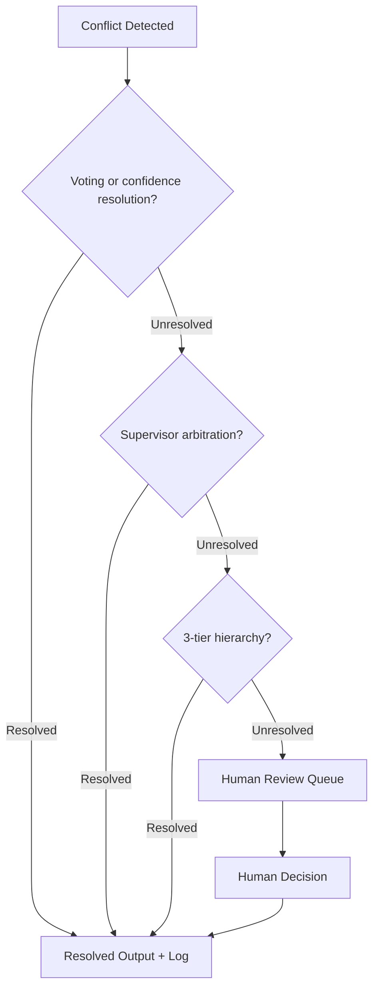

# Task Decomposition & Conflict Resolution

How an orchestrator breaks a complex goal into subtasks, and how the system handles disagreements between agents that produce contradictory results.

---

## Part 1 — Task Decomposition

### 1.1 Planning Paradigms

Four dominant approaches, each with different trade-offs between adaptability and predictability:

#### ReAct (Reason + Act)

The agent interleaves reasoning steps (Thought) and action steps (Action/Observation) in a tight loop. No upfront plan — the agent decides the next step based on the current state and previous observations.

```
Thought: I need to find the revenue for Q4. I'll query the DB first.
Action: query_db("SELECT revenue FROM quarterly WHERE quarter='Q4'")
Observation: [{"revenue": 4200000}]
Thought: Now I need to compare against Q3. Query again.
Action: query_db("SELECT revenue FROM quarterly WHERE quarter='Q3'")
Observation: [{"revenue": 3800000}]
Thought: Q4 was 10.5% higher. I can now draft the analysis.
Action: draft_report(...)
```

**Strengths:** Adaptive — responds to unexpected tool outputs. Works well for exploratory tasks where the path is not known upfront.
**Weaknesses:** Can lose track of the overall goal in long chains. Each step depends on the previous — no parallelism. Difficult to audit at workflow level.

**Best for:** Single-agent tactical decision loops. Customer support routing. Any task where the next step depends on the result of the current one.

---

#### Plan-and-Execute

The agent first produces a complete plan (a structured list of steps with dependencies), then executes each step. Planning and execution are separate phases.

```
Phase 1 — Plan:
  1. Search external market data for Q4 benchmark (parallel)
  2. Query internal revenue DB for Q4 (parallel)
  3. Query internal revenue DB for Q3 (parallel)
  4. Compare results and identify variance drivers (depends on 1, 2, 3)
  5. Draft executive summary (depends on 4)

Phase 2 — Execute:
  Steps 1, 2, 3 → parallel
  Step 4 → after 1, 2, 3
  Step 5 → after 4
```

**Strengths:** Exposes the full DAG of dependencies upfront, enabling parallel execution. Easier to observe, audit, and debug — the plan is an artifact. Predictable resource usage.
**Weaknesses:** Plan may be invalidated by unexpected results mid-execution. Replanning is expensive (another LLM call). Poor for exploratory tasks.

**Best for:** Structured multi-step workflows where the steps are known in advance. Financial analysis, compliance review, report generation.

---

#### Tree of Thoughts (ToT)

The orchestrator generates multiple candidate decompositions (branches), evaluates each, prunes weak branches, and expands the most promising ones. Forms an explicit search tree over possible plans.

```
Goal: Assess acquisition risk
├── Branch A: Financial analysis first → valuation → risk score
│   └── Evaluation: High quality but slow
├── Branch B: Legal review first → financial → risk score
│   └── Evaluation: Faster but misses synergies
└── Branch C: Parallel legal + financial → synthesis → risk score
    └── Selected: Best coverage and parallelism
```

**Strengths:** Explores multiple strategies before committing. Finds non-obvious decompositions. High accuracy on complex reasoning tasks.
**Weaknesses:** 3–5× higher token cost than ReAct for the same task. Latency penalty from tree expansion. Overkill for straightforward tasks.

**Best for:** High-stakes complex analysis where the cost of a wrong decomposition is high (M&A due diligence, legal strategy, drug interaction analysis).

---

#### DAG-Based Static Decomposition

The decomposition is defined at design time as a static Directed Acyclic Graph. The orchestrator executes the graph — no LLM reasoning needed for planning.

```
[Ingest] → [Validate] → [Enrich] → [Score] → [Route]
                              └────────────────────────► [Escalate] (conditional)
```

**Strengths:** Fully deterministic — same input always produces the same execution path. Cheapest to run. Easiest to audit. Natural fit for regulated workflows.
**Weaknesses:** Cannot handle tasks outside the defined graph. No adaptation.

**Best for:** Well-understood repeatable workflows — loan origination, document approval chains, compliance checks. Any workflow that must be explainable to regulators.

### 1.2 Decomposition Strategies Compared

| Strategy | Planning cost | Parallelism | Adaptability | Auditability | Use case |
|---|---|---|---|---|---|
| **ReAct** | Zero (no upfront plan) | None (sequential) | High | Per-step | Tactical exploration |
| **Plan-and-Execute** | One LLM call | Full DAG | Low | Full plan as artifact | Structured known workflows |
| **Tree of Thoughts** | High (branching) | Within branches | High | Full tree | High-stakes complex reasoning |
| **Static DAG** | Zero (code) | Full DAG | None | Perfect | Regulated repeatable processes |

### 1.3 Failure Modes of Bad Decomposition

| Failure | Cause | Effect |
|---|---|---|
| **Step ambiguity** | Subtask description too vague for the worker agent | Worker improvises, produces misaligned output |
| **Missing dependency** | Step 4 starts before Step 3 completes | Worker uses stale or empty data |
| **Over-decomposition** | Task split into more steps than necessary | Coordination overhead dominates; 10× token cost for marginal accuracy gain |
| **Under-decomposition** | One step has too many responsibilities | Worker context overflows; poor-quality output |
| **No handoff contract** | Steps communicate via raw text, not typed schema | Errors propagate silently across steps |
| **Context not carried** | Later steps lack context from earlier steps | Agent makes decisions inconsistent with prior findings |

**Rule:** Every step in a decomposition must specify its input contract, output contract, and explicit dependencies. A step that cannot be described by these three things is not ready to execute.

---

### 1.4 What Frameworks Offer

Each framework exposes different primitives for decomposition. The key question to ask of any framework: *which paradigm from §1.1 does it actually implement, and at what layer — code or LLM?*

**Paradigm-to-framework mapping:**

| Paradigm | Framework implementation |
|---|---|
| **ReAct** | AutoGen SelectorGroupChat turn loop; LlamaIndex AgentWorkflow handoffs |
| **Plan-and-Execute** | LangGraph Send API fan-out; CrewAI hierarchical process; AutoGen planning agent + workers |
| **Tree of Thoughts** | No mainstream framework has native ToT primitives — implemented manually or via LATS research code |
| **Static DAG** | LangGraph fixed edges; LlamaIndex Workflow step graph; Temporal activities in workflow code |

The implication: if you want **reactive, exploratory decomposition**, use AutoGen or LlamaIndex handoffs. If you want **parallel Plan-and-Execute**, use LangGraph Send or CrewAI hierarchical. If you want **deterministic, regulated pipelines**, use Temporal or a static LangGraph graph with no Send API. No single framework covers all four paradigms well.

---

#### LangGraph — Static DAG and Dynamic Plan-and-Execute

**Paradigm: Static DAG + Plan-and-Execute (runtime fan-out)**

LangGraph maps directly onto the two code-driven paradigms from §1.1. The graph topology you define at build time *is* your decomposition strategy — there is no separate planning layer unless you add one.

- `graph.add_edge(A, B)` → static dependency; executes in fixed order → **Static DAG**
- `graph.add_conditional_edges(plan, send_fn)` → planner node emits `Send` objects at runtime → **Plan-and-Execute with parallel fan-out**

The **Send API** is the critical primitive for dynamic decomposition. A planning node returns a list of `Send` objects — one per subtask — and LangGraph spawns them in parallel as independent node instances:

```python
from langgraph.types import Send

def plan_node(state: PlanState) -> list[Send]:
    subtasks = decompose(state["goal"])          # LLM generates subtask list
    return [Send("execute_subtask", {"task": t}) for t in subtasks]

graph.add_conditional_edges("plan", plan_node)  # fan-out at runtime
```

The number of parallel branches is determined at runtime by the planner — this is Plan-and-Execute where the plan is the list of `Send` objects. Results from all branches merge in a subsequent reduce node.

**What LangGraph does not give you out of the box:** ReAct-style adaptive loops require you to model the Thought/Action/Observation cycle explicitly as a graph cycle. ToT requires building a custom branching evaluator. LangGraph is a graph execution engine — the decomposition *logic* lives in your planner node, not in the framework.

---

#### AutoGen v0.4 — ReAct-Style Turn Loop with Agent Routing

**Paradigm: ReAct (reactive, no upfront plan)**

AutoGen's **SelectorGroupChat** implements a reactive decomposition that mirrors ReAct at the multi-agent level: no plan is generated upfront. After each agent contribution, the selector model picks the next agent to speak based on the current conversation state and agent descriptions. This is the group-chat equivalent of Thought → Action → Observation — each turn is one reasoning-and-action step, and the next step is chosen reactively.

```python
from autogen_agentchat.teams import SelectorGroupChat

team = SelectorGroupChat(
    [planning_agent, code_agent, research_agent, review_agent],
    model_client=model_client,
    selector_prompt="Given the conversation so far, select the next agent."
)
# No plan generated — agents react to each other's outputs
result = await team.run(task="Audit this codebase for security vulnerabilities.")
```

For **Plan-and-Execute** in AutoGen, you must explicitly add a planning agent whose first action is to generate a structured plan, and whose subsequent turns dispatch to workers. The framework does not enforce or structure this — it is a prompting and agent-design convention, not a framework primitive.

AutoGen v0.4 also introduced **resumable execution** — task state is serialized between steps, allowing long workflows to survive restarts. This is infrastructure support for any paradigm, not a decomposition pattern itself.

---

#### CrewAI — Sequential DAG and Plan-and-Execute via Manager

**Paradigm: Static DAG (sequential) or Plan-and-Execute (hierarchical)**

CrewAI exposes decomposition through its `Process` enum, which directly maps to two paradigms:

- `Process.sequential` → **Static DAG**: tasks execute in the order they are defined. The decomposition is hardcoded by the developer. No replanning.
- `Process.hierarchical` → **Plan-and-Execute**: a manager agent (or an LLM-backed coordinator) generates task assignments at runtime, delegating to specialist crew members.

```python
from crewai import Crew, Process

# Static DAG: decomposition is fixed at design time
crew = Crew(agents=[researcher, writer, reviewer], tasks=[t1, t2, t3],
            process=Process.sequential)

# Plan-and-Execute: manager decomposes at runtime
crew = Crew(agents=[manager, researcher, writer, reviewer], tasks=[main_task],
            process=Process.hierarchical, manager_llm=strong_model)
```

The 2025 **`allowed_agents` parameter** adds hierarchy to the delegation: each agent specifies which other agents it may delegate to, preventing unintended cross-delegation and enforcing the intended decomposition structure.

**What CrewAI does not give you:** No native ReAct loop (sequential process is strictly linear). No parallel fan-out in the style of LangGraph Send — the hierarchical manager delegates sequentially by default.

---

#### LlamaIndex Workflows — Static DAG and ReAct Handoffs

**Paradigm: Static DAG + ReAct (agent handoffs)**

LlamaIndex Workflows expresses decomposition as a typed event graph. Each `@step` consumes one event type and emits one or more event types. The graph of steps and their event connections defines a **Static DAG** at design time.

```python
from llama_index.core.workflow import Workflow, step, Event

class SubtaskEvent(Event):
    task: str

class ResearchWorkflow(Workflow):
    @step
    async def plan(self, ctx: Context, ev: StartEvent) -> list[SubtaskEvent]:
        subtasks = await planner_agent.run(ev.goal)
        return [SubtaskEvent(task=t) for t in subtasks]   # fan-out

    @step
    async def execute(self, ctx: Context, ev: SubtaskEvent) -> ResultEvent:
        return ResultEvent(result=await specialist_agent.run(ev.task))
```

Emitting multiple events from a step implements Plan-and-Execute fan-out, but the step graph itself is static.

**AgentWorkflow** (higher-level abstraction) adds **ReAct-style handoffs**: agents decide which other agent to pass control to based on the current task context. This is reactive — no upfront plan, the next handler is chosen by the current agent's output. Decomposition emerges from handoff decisions rather than being planned in advance.

---

#### Temporal — Static DAG with Durable Execution Guarantees

**Paradigm: Static DAG (with runtime parallelism)**

Temporal workflows are Python (or Go/Java) code. The activity calls in your `@workflow.run` method define the decomposition — the structure is fixed at write time, making it a **Static DAG** expressed as code rather than a graph definition file.

```python
@workflow.defn
class ResearchWorkflow:
    @workflow.run
    async def run(self, topic: str):
        sources = await workflow.execute_activity(gather_sources, topic)
        # Parallel fan-out via asyncio.gather — but the pattern is fixed in code
        analyses = await asyncio.gather(*[
            workflow.execute_activity(analyze_source, s) for s in sources
        ])
        return await workflow.execute_child_workflow(SynthesisWorkflow, analyses)
```

The decomposition is **not driven by an LLM at planning time** — it is driven by the workflow code. Temporal's contribution is not a new decomposition paradigm; it is **durable execution**: every activity has exactly-once semantics, the workflow survives crashes and restarts, and state is persisted automatically at every activity boundary.

**When to prefer Temporal over LangGraph:** when the workflow duration is hours to days, when activities may fail and need automatic retry with backoff, or when you need guaranteed exactly-once execution that no LLM framework provides. The cost is more infrastructure complexity and a harder learning curve.

---

### 1.5 What Scales in Production

The parallelism gains from decomposition are real, but so are the failure modes that only appear at scale.

#### Compound Reliability Decay

Individual step reliability multiplies across a pipeline. With 95% per-step success rate:

| Steps | Overall success |
|---|---|
| 5 steps | 77.4% |
| 10 steps | 59.9% |
| 20 steps | 35.8% |

The implication: decompose into the minimum number of steps that satisfies the task. Every additional step is a reliability tax.

#### Token Budget Management

Multi-agent decomposition amplifies token usage because each agent receives context, and that context is often redundant across agents:

- **Token multiplier at scale:** 1.5× to 7× overhead from redundant context sharing between sub-agents
- **Documented incidents:** Agents with 128K context windows processing thousands of iterations at 27M+ tokens per session
- **Mitigations:** Per-agent token budgets; streaming results instead of full context forwarding; hierarchical decomposition with coarse-grained subtasks to reduce coordination overhead; summarize completed context before passing to next step

#### Checkpoint Everything

Production-grade decomposition requires checkpoints between every major step boundary. The alternatives — restarting the entire workflow on failure, or accepting silent state loss — are unacceptable at any scale. Temporal handles this natively. For LangGraph, use a persistent checkpointer (Postgres, Redis) rather than the in-memory default.

#### What Cannot Be Decomposed

Some tasks resist clean decomposition and degrade when split:

- **Architectural decisions** that require holistic reasoning over the full context
- **Creative synthesis** where coherence depends on a single consistent perspective
- **Novel research** where the decomposition itself requires domain expertise that the planner lacks
- **Cross-cutting concerns** where every subtask modifies shared state and ordering matters

Forcing decomposition on these tasks produces locally correct but globally incoherent outputs. Recognize them early and execute them as single-agent tasks with a large context window.

---

## Part 2 — Conflict Resolution

Conflicts are inevitable in multi-agent systems. Two agents researching the same topic will produce different findings. Two analysts will assess the same risk differently. Conflict resolution is what separates a system that produces coherent results from one that produces noise.

### 2.1 Types of Conflict

| Type | Description | Example |
|---|---|---|
| **Factual conflict** | Two agents report different facts for the same question | Revenue agent says $4.2M; accounting agent says $4.5M |
| **Interpretive conflict** | Same data, different conclusions | Risk agent: "acceptable risk"; compliance agent: "regulatory breach" |
| **Priority conflict** | Two agents both want to act on the same resource | Two workflow agents trying to update the same record simultaneously |
| **Scope conflict** | Agents' mandates overlap — both believe they own a subtask | Legal and compliance agents both drafting the same contract clause |
| **Temporal conflict** | Outputs are individually correct but based on different data snapshots | Agent A uses data from 09:00; Agent B uses data from 09:05 |

### 2.2 Detection

Conflicts must be detected before resolution can begin. Three detection mechanisms:

**Schema validation:** If agents return typed JSON and a field has two conflicting values, the conflict is surfaced immediately at merge time. The cheapest and most reliable detection method.

**Semantic comparison:** An evaluator agent (or embedding similarity check) compares the outputs of two agents for semantic contradiction — even if the format is different. Catches interpretive conflicts that schema validation misses.

**Consistency rules:** Explicitly defined business rules that flag conflicts: "if credit_risk_score > 7 and compliance_status = 'approved', flag for review." Catches domain-specific logical inconsistencies.

### 2.3 Resolution Strategies

#### Voting / Majority Consensus

Multiple independent agents evaluate the same input. The majority answer is taken as the result. Optionally weighted by agent confidence scores.

```
Agent A: "High risk"  (confidence: 0.82)
Agent B: "High risk"  (confidence: 0.91)
Agent C: "Medium risk" (confidence: 0.64)

Weighted vote: High risk wins (combined weight: 0.86 vs 0.64)
```

**When to use:** Tasks where multiple independent perspectives improve confidence. Risk assessment, content moderation, code review.
**Limitation:** Correlated errors can drown out the correct minority. If all agents were trained on similar data, they may be wrong in the same direction. ACL 2025 research found voting protocols improve reasoning task performance by **13.2%** but only **2.8%** on knowledge tasks — consensus protocols perform better for factual accuracy.

---

#### Confidence-Based Selection

Each agent attaches a confidence score to its output. The highest-confidence response is selected, or outputs below a threshold are discarded before merging.

```
if max(confidence_scores) > 0.85:
    use highest-confidence output
elif all(scores) < 0.60:
    escalate to human review
else:
    proceed to arbitration
```

**When to use:** Homogeneous agent pool with calibrated confidence outputs. Fast, low-cost resolution for most cases.

---

#### Supervisor Arbitration

A designated supervisor agent receives the conflicting outputs and makes an explicit arbitration decision, with reasoning.

```
Supervisor receives:
  Agent A output: {revenue: 4.2M, confidence: 0.78}
  Agent B output: {revenue: 4.5M, confidence: 0.82}

Supervisor reasons: "B used the corrected ledger data from the finance API.
  A used the pre-adjustment export. B's figure is authoritative."

Arbitration result: 4.5M (with reasoning logged)
```

**When to use:** High-stakes decisions where the resolution must be explainable. Financial disputes, legal conflicts, compliance determinations.
**Cost:** One additional LLM call per conflict. Supervisor must be prompt-engineered to reason about evidence, not just pick the higher-confidence output.

---

#### Three-Tier Hierarchy (Consensus Resolution Protocol)

A structured escalation model that resolves conflicts at the lowest applicable tier:

| Tier | Resolution basis | When applied |
|---|---|---|
| **Tier 1 — Policy** | Organizational governance rules and defined authority (e.g., compliance always overrides cost optimization) | When a defined policy explicitly covers the conflict |
| **Tier 2 — Capability authority** | The agent with domain expertise in the specific sub-area of the conflict takes precedence | When no policy covers it, but one agent has a narrower, more authoritative mandate |
| **Tier 3 — Temporal** | The most recent, fresher data takes precedence | When tiers 1 and 2 produce no clear winner |
| **Escalation — HITL** | Human review | When all three tiers fail to resolve unambiguously |

**Key principle:** Conflicts cascade downward only when a higher tier cannot produce an unambiguous resolution.

---

#### Evidence-Based Merging

Instead of picking one agent's output, a merger agent synthesizes both into a single coherent response, explicitly noting where uncertainty remains.

```
Merged output:
  "Revenue for Q4 is reported as $4.2M by the pre-adjustment export
  and $4.5M by the corrected ledger. The $300K discrepancy originates
  from a reclassification posted 15 Nov. The audited figure is $4.5M.
  Confidence: high."
```

**When to use:** Research and analysis tasks where surface contradiction actually represents nuance that should be preserved. Avoids false precision.

---

### 2.4 Escalation to Human Review

All resolution strategies must have a defined escalation path to human review:



Every conflict and its resolution must be logged with: the conflicting values, the resolution strategy applied, the reasoning, and the final outcome. This log is the audit trail for compliance and post-incident analysis.

---

## References

- [Language Agent Tree Search — LATS (ICML 2024)](https://arxiv.org/abs/2310.04406)
- [AFlow: Automating Agentic Workflow Generation (ICLR 2025)](https://arxiv.org/abs/2410.10762)
- [EvoAgentX (EMNLP 2025)](https://aclanthology.org/2025.emnlp-demos.47/)
- [AdaptOrch: Dynamic Topology Selection (arXiv 2602.16873, Feb 2026)](https://arxiv.org/abs/2602.16873)
- [Agentic Computation Graphs (arXiv 2604.11378, Feb 2026)](https://arxiv.org/html/2604.11378v1)
- [ITBench: Real-World IT Automation Benchmark (IBM, ICML 2025 / AAAI 2026)](https://research.ibm.com/publications/developing-ai-agents-for-it-automation-tasks-with-itbench-for-aaai-2026)
- [TheAgentCompany (NeurIPS 2025)](https://neurips.cc/virtual/2025/poster/121705)
- [PlanBench: LLM Planning Evaluation (NeurIPS 2023)](https://arxiv.org/abs/2206.10498)
- [TDAG: Multi-Agent Framework with Dynamic Task Decomposition](https://arxiv.org/abs/2402.10178)
- [DeepSeek-R1: RL-based Reasoning (arXiv 2501.12948)](https://arxiv.org/abs/2501.12948)
- [OpenAI o3 and o4-mini](https://openai.com/index/introducing-o3-and-o4-mini/)
- [AutoGen v0.4: Reimagining Agentic AI](https://www.microsoft.com/en-us/research/blog/autogen-v0-4-reimagining-the-foundation-of-agentic-ai-for-scale-extensibility-and-robustness/)
- [LangGraph — Send API and Map-Reduce](https://langchain-ai.github.io/langgraph/how-tos/map-reduce/)
- [CrewAI — Hierarchical Process](https://docs.crewai.com/en/learn/hierarchical-process)
- [ACL 2025 — Voting Protocols in Multi-Agent Reasoning](https://aclanthology.org/)
- [Anthropic — Building Effective AI Agents](https://resources.anthropic.com/building-effective-ai-agents)
