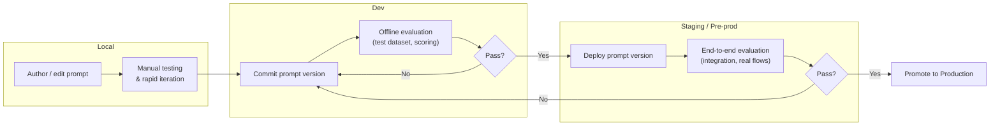
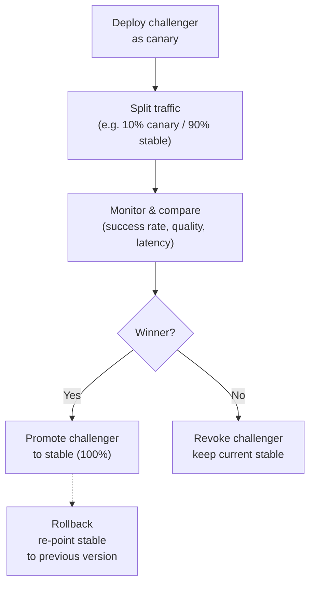
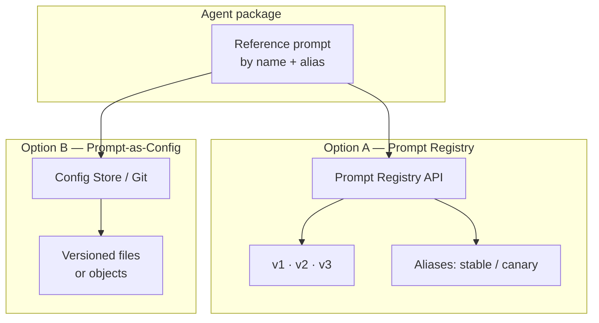

# Prompt Release Lifecycle for AI Agents

## Context

An agent is composed of several building blocks: code, prompts, tools, sub-agents, skills, and LLM models. While the agent code follows a well-understood software release lifecycle (commit → build → test → deploy), prompts have fundamentally different characteristics:

- They change more frequently than code.
- A small wording change can significantly alter agent behavior.
- Non-developer stakeholders (product owners, domain experts) often need to iterate on them.
- They need to be compared, evaluated, and rolled back independently of code deployments.


## Problem Statement

Coupling prompts to the code release cycle creates unnecessary friction: every prompt tweak requires a commit, a PR, a build, and a full redeploy.
There is no defined release lifecycle for prompts that is decoupled from the agent code release cycle. As a result:

- Prompt changes are slow to ship because they are bundled with code releases.
- There is no structured way to version, compare, or A/B test prompt variants.
- Rolling back a prompt requires rolling back the entire agent deployment.
- It is difficult to attribute changes in agent behavior to a specific prompt revision.

## Requirements

| # | Requirement                                                                                                          |
|---|----------------------------------------------------------------------------------------------------------------------|
| R1 | Prompts must be versionable independently of agent code                                                              |
| R2 | A prompt version must be immutable once published                                                                    |
| R3 | It must be possible to roll back to a previous prompt version without going throug the entire agent release lifecyle |
| R4 | It must be possible to run A/B tests between two or more prompt variants on live traffic                             |
| R5 | Prompt changes should be auditable (who changed what, when)                                                          |
| R6 | The mechanism should support evaluation/scoring of prompt variants against defined criteria                          |

## Options

### Option A — Prompt Registry (platform-managed)

Introduce a dedicated prompt registry as a platform service. Agents fetch their prompt at runtime by reference (name + version/alias).

**How it works:**

1. Prompts are authored and versioned in the registry (via UI or API).
2. Each version is immutable and gets a unique identifier.
3. The agent code references a prompt by name and an alias (e.g. `latest`, `stable`, `canary`).
4. A/B testing is achieved by splitting traffic across aliases pointing to different versions.
5. Rollback = re-point the alias to a previous version.

**Agent configuration:**

The agent must be configured with the prompt name and a resolution strategy via environment variables:

```
PROMPT_NAME=my-agent-system-prompt
PROMPT_VERSION=stable          # alias or explicit version
```

This enables two usage modes:

- **Alias-based (default):** Set `PROMPT_VERSION` to an alias like `stable` or `latest`. When a new prompt version is promoted to that alias in the registry, all agents pick it up automatically — no redeployment needed.
- **Pinned version (experiment / A/B testing):** Set `PROMPT_VERSION` to an explicit version (e.g. `v3`). This locks the agent to a specific prompt revision, which is useful for controlled experiments, A/B testing across deployment targets, or canary rollouts where different instances run different versions.

**Existing implementations of this pattern:**

- [Langfuse Prompt Management](https://langfuse.com/docs/prompt-management/overview) — open-source, version tracking, labels/aliases, SDK fetch at runtime.
- [MLflow Prompt Registry](https://mlflow.org/prompt-registry) — decouples prompts from code, versioning, open-source.

| Pros | Cons |
|------|------|
| Full decoupling — prompt iteration is independent of code deploys | New infrastructure component to build or adopt |
| Native support for versioning, aliases, rollback, A/B testing | Adds a runtime dependency (agent must fetch prompt at startup or per-request) |
| Enables non-developers to manage prompts via UI | Requires caching/fallback strategy for availability |
| Audit trail built-in | |

### Option B — Prompt-as-Config (externalized configuration)

Treat prompts as configuration files stored outside the agent code repository (e.g. in a config service or a Git repo dedicated to prompts). The agent loads its prompt from this external config at startup or on a schedule.

**How it works:**

1. Prompts live in a separate Git repo or config store (config service, key-value store, etc.).
2. Versioning is handled by the underlying store (Git history, config service versioning).
3. The agent reads the prompt from the config source at startup or via a refresh mechanism.
4. A/B testing is implemented at the application level by loading multiple prompt variants and routing traffic.

| Pros | Cons |
|------|------|
| Simple — uses existing infrastructure (Git, config store) | A/B testing and traffic splitting must be built manually |
| No new platform service to maintain | No built-in UI for non-technical users |
| Familiar workflow for developers (PR-based for Git, API for config stores) | Audit trail depends on the underlying store |
| Low adoption barrier | Rollback is possible but less ergonomic than alias-based switching |

## Runtime Prompt Loading

Regardless of the option chosen, the agent needs a strategy for loading prompts at runtime. Two dimensions matter: when to load and how to cache.

### Loading strategies

| Strategy | Description | Trade-off |
|----------|-------------|-----------|
| Cold load (startup only) | Prompt is fetched once when the agent starts. Changes require a restart. | Simplest; no runtime dependency on the store after init. Slowest to propagate changes. |
| TTL-based cache | Prompt is cached locally with a time-to-live. After expiry, the agent re-fetches from the store. | Good balance between freshness and performance. TTL tuning is key: too short = unnecessary load; too long = stale prompts. |
| Event-driven hot-reload | The agent is notified when a prompt changes (webhook, pub/sub, file watcher) and reloads immediately. | Fastest propagation. More complex to implement; requires the store to emit change events. |

### Fallback behavior

In all cases, the agent should implement a fallback: if the store is unreachable, serve the last known cached prompt rather than failing. A bundled default prompt in the agent code can serve as a last-resort fallback.

## Comparison

| Feature |        Option A — Prompt Registry         |         Option B — Prompt-as-Config          |
|---------|:-----------------------------------------:|:--------------------------------------------:|
| Decoupled from code releases |                   ✅ Yes                   |                    ✅ Yes                     |
| Prompt versioning |            ✅ Native, immutable            |   ⚠️ Depends on store (Git/config service)   |
| Prompt immutability guarantee |                   ✅ Yes                   |      ❌ No — content can be overwritten       |
| Alias / label support |   ✅ Built-in (`stable`, `canary`, etc.)   |       ❌ No — must be convention-based        |
| Instant rollback |             ✅ Re-point alias              |      ⚠️ Revert commit or config change       |
| A/B testing |        ✅ Built-in (alias routing)         |           ❌ Must be built manually           |
| UI for non-developers |                   ✅ Yes                   |                     ❌ No                     |
| Hot-reload safety |        ✅ Safe (immutable versions)        |        ⚠️ Needs checksum verification        |
| Infrastructure overhead | ❌ Potential new service to build or adopt |            ✅ Uses existing infra             |
| Runtime dependency | ❌ Agent depends on registry availability  | ✅ Agent depends on config store availability |
| Cross-squad coordination |   ❌ Required (shared platform service)    |                  ✅ Minimal                   |


## Prompt Release Lifecycle

The lifecycle applies regardless of the storage mechanism (Option A or B). It spans four environments, each with its own purpose, iteration speed, and promotion gate.


### Lifecycle by Environment (Local → Dev → Staging)



### Production Lifecycle

Once a prompt version passes the staging e2e gate, it enters production as a **challenger** against the current **stable** prompt.



| Step | Description |
|------|-------------|
| Deploy challenger | The new prompt version is deployed under the `canary` alias alongside the current `stable` |
| Split traffic | A percentage of live traffic is routed to the challenger (e.g. 10/90, 20/80) |
| Monitor & compare | Business and quality metrics are compared between canary and stable (task success rate, user satisfaction, error rate, latency) |
| Winner → Promote | If the challenger outperforms or matches stable, promote it: re-point `stable` alias to the challenger version, remove `canary` |
| No winner → Revoke | If the challenger underperforms, revoke it: remove the `canary` alias, 100% traffic returns to the current `stable`. No rollback needed — stable was never changed |
| Rollback | If a promoted prompt causes issues after full rollout, re-point `stable` to the previous version (instant in Option A, config revert in Option B) |

### Storage Mechanism by Option



## Recommendation

**Start with Option B** if the team is small and prompt iteration is primarily developer-driven — it delivers decoupling with minimal overhead using existing tools (Git + config store).

**Move to Option A** when the platform scales and you need structured A/B testing, non-developer prompt authoring, or a unified audit trail. At that point, evaluate whether to build a lightweight internal registry or adopt an existing solution (Langfuse or MLflow for an open-source path).

In both cases, the key architectural decision is the same: the agent code must reference prompts by name/version rather than embedding them — this is the prerequisite that makes either option viable.

## References

- [Langfuse Prompt Management](https://langfuse.com/docs/prompt-management/overview)
- [MLflow Prompt Registry](https://mlflow.org/prompt-registry)
- [Braintrust - What is prompt management?](https://www.braintrust.dev/articles/what-is-prompt-management)
