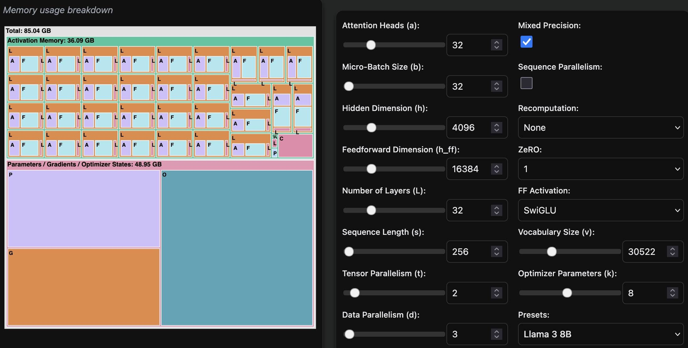

# Training Optimization techniques

## Model parallelism techniques

When you are GPU poor, you must use as much as possible techniques to optimize your training.
There is a very good and complete [Ultra scale playbook](https://huggingface.co/spaces/nanotron/ultrascale-playbook) that goes through these techniques and offer some nice overview.
You can simulate the memory required for llama architecture families before and after optimization.
This is the workload effort to train llama 8B before applying any optimization technique (using mixed precision):

And this is the effort using 3 data parallel streams and 2 tensors streams. Quite a significant change !

Obviously, this requires having significant compute and GPU to parallelize the workload.
Here's a very useful cheatsheet from their blog:

### Data parallelism

We use several GPUs (we call the replicas “model instances”) and run forward and backward passes on different micro-batches of data in parallel on each GPU. Using a different micro-batch for each GPU means we’ll have different gradients on each GPU, so to keep the model instances in sync across the different GPUs, we'll average the gradients from the model instances using an operation called “all-reduce.” This operation takes place during the backward pass, before the optimizer step.

This involves our first “distributed communication” primitive, all-reduce, which handles the synchronization and communication between GPU instances and nodes.

The feature distributedDataParallel is a built-in feature in PyTorch see (<https://docs.pytorch.org/docs/stable/generated/torch.nn.parallel.DistributedDataParallel.html>) is a way to test this.

There are two main approaches to splitting: parallelism (tensor, context, or pipeline parallelism) and sharding (DeepSpeed ZeRO or PyTorch FSDP). Both approaches are somewhat orthogonal and can actually be combined!

Deepspeed Zero methods has three possible optimization stages:

- ZeRO-1: optimizer state partitioning
- ZeRO-2: optimizer state + gradient partitioning
- ZeRO-3: optimizer state + gradient + parameter partitioning

It significantly improves training. DP only works if a layer of the model fits in a single GPU, and ZeRO can only partition the parameters, gradients, and optimizer states, not the activation memory. This is a clear limitation that we want to overcome.

Another core painpoint of this technique is that it requires heavy parameter communication.

So it's time to explore tensor parallelim (TP) which proposes to shard parameters, gradients, optimizer states, AND activations across devices without requiring any communication of model parameters between GPUs.

### Tensor parallelism

Training on long input sequences requires huge amounts of GPU memory. This technique splits the processing of a single sequence across multiple GPUs. Each tensor is split up into multiple chunks, so instead of having the whole tensor reside on a single gpu, each shard of the tensor resides on its designated gpu. During processing each shard gets processed separately and in parallel on different GPUs and the results are synced at the end of the step. This is what one may call horizontal parallelism, as the splitting happens on horizontal level.

Tensor parallelism basically splits matrices into rows and columns so calculation can be split across GPUs independently. Results of each sub calculation is either gathered or reduced to a final matrix.

### Sequence parallelism

Self-Attention, which is the key component of Transformers, suffers from quadratic memory requirements with respect to the sequence length, therefore when sequence length gets to a certain length, even a batch size of 1 might not be able to fit onto a single GPU and require additional partitioning along the sequence dimension. And once this is done, the sequence can be of any length.
As this type of parallelism is orthogonal to the other parallelization types described in this document, it can be combined with any of them, leading to 4D, ZeRO-DP+SP and other combinations.

Sequence parallelism (SP) involves splitting the activations and computations for the parts of the model not handled by tensor parallelism, such as dropout and LayerNorm, but along the input sequence dimension rather than the hidden dimension.

### Context parallelism

Context parallelism is the same thing as sequence parallelism as we split the input sequence (mandatory for some long context window models). However, we apply sequence parallelism in layers not covered by TP while context applies on layers with TP.

Both sequence and context length address optimization for the length of your input.
However, very frequently, this is the number of parameters that is the biggest bottleneck. Not enough ? Let's see Pipeline parallelism !

### Pipeline parallelism

Pipeline Parallelism (PP) is almost identical to a naive MP, but it solves the GPU idling problem, by chunking the incoming batch into micro-batches and artificially creating a pipeline, which allows different GPUs to concurrently participate in the computation process.
Essentially, you split model layers across GPUs.

### Experts parallelism

When Mixture-Of-Experts (MoE) is used (in particular during inference) one could give each expert its own accelerator (or a few if one isn't enough), which is referred to as Expert Parallelism (EP). This adds another dimension for parallelization and can significantly speed things up for large batches that are likely to hit all of the experts. Instead of communicating model weights, in EP tokens are being communicated instead. EP leads to a more efficient compute as matrix multiplication then deal with bigger inputs.

### Summary of 5D parallelism techniques

| Method     | Memory savings apply specifically on...                | Parallel/sharding dimension            | Disadvantage                                         |
|------------|---------------------------------------------------------|----------------------------------------|------------------------------------------------------|
| DP         | Activations (reduce local batch size)                  | Batch                                  | Limited by max batch size                            |
| PP         | Model parameters                                        | Model layers                           | Idle bubble and complex schedules                    |
| TP+SP      | Model parameters and activations                        | Hidden dimension/sequence length       | Requires high-bandwidth communication                |
| CP         | Activations                                             | Sequence length                        | Adds communication overhead in attention modules     |
| EP         | Experts parameters                                      | Experts dimension                      | Requires MoE layers, adds routing communication overhead |
| ZeRO-1     | Optimizer states                                        | Sharded among DP replicas              | Params communication overhead                        |
| ZeRO-2     | Optimizer states and gradients                          | Sharded among DP replicas              | Params communication overhead                        |
| ZeRO-3     | Optimizer states, gradients, and model parameters      | Sharded among DP replicas              | Params communication overhead                        |

## Other Optimization techniques

- Gradient accumulation enables larger effective batch sizes
- Memory efficient optimizers
- Activation checkpointing trades computation for memory by recalculating certain activations
- Model checkpoints
- Federated learning
- Data parallelism (fully sharded data parallelism)
- distributed training

## Example of training process including data refinement

<https://huggingface.co/spaces/HuggingFaceFW/blogpost-fineweb-v1>

<https://developer.nvidia.com/blog/mastering-llm-techniques-data-preprocessing/>

<https://magazine.sebastianraschka.com/p/instruction-pretraining-llms>

## Sources

Picotron: for educational purposes, you can train a llama model using parralelism techniques: <https://github.com/huggingface/picotron>

<https://www.andrew.cmu.edu/course/11-667/lectures/W10L2%20Scaling%20Up%20Parallel%20Training.pdf>
<https://github.com/stas00/ml-engineering/tree/master/training>

